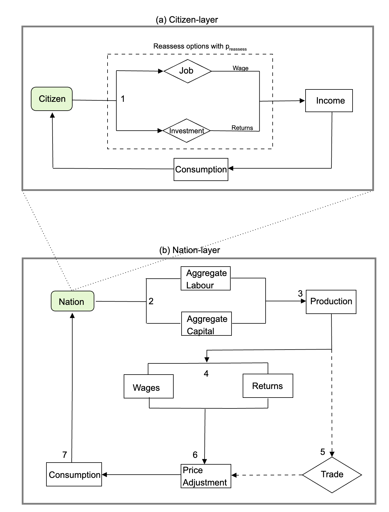
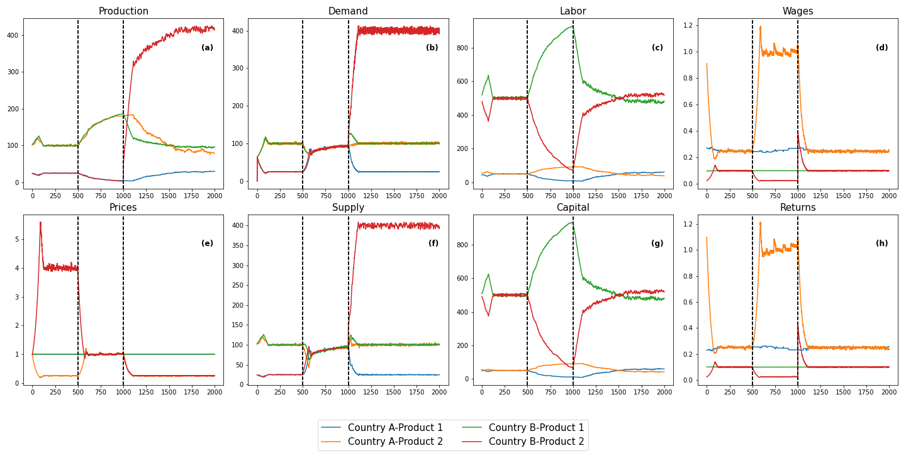
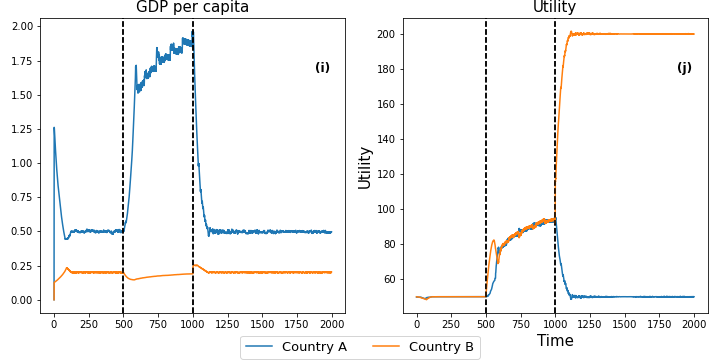
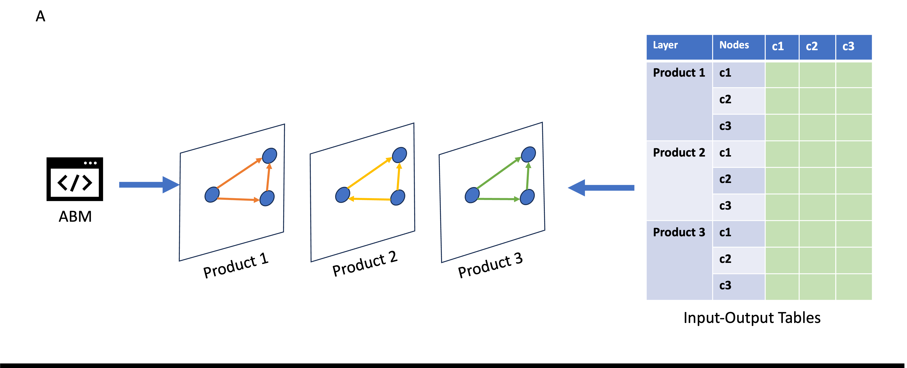
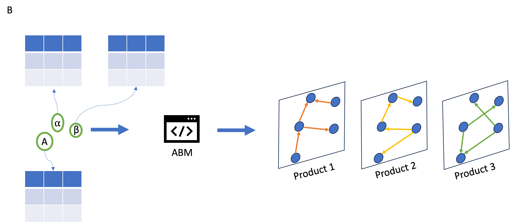

> 📄 Kumar, N., Vu, T., Carrella, E., Guerrero, O., & Dobrantu, C. (forthcoming). *A Generalised Agent‑Based Model for Modelling International Trade.* 

# 🌐 Generalized Agent‑Based Model for International Trade

This repository contains the codebase and simulation outputs for a modular, scalable **agent‑based model (ABM)** of international trade. The model captures how citizens across countries make labour and investment decisions that drive trade, production, price formation, and policy outcomes like tariffs — inspired by and extending classical Heckscher‑Ohlin and New‑Trade‑Theory frameworks.

---

## 📌 Features

* 🧠 Agent‑based modelling of labour, capital, and consumption decisions
* 🏭 Multi‑country × multi‑sector generalisation (n countries × m sectors)
* 💸 Capital‑mobility switch, endogenous prices, heterogeneous utility rules
* 📦 Plug‑and‑play production / wage / demand functions
* 🌍 Bilateral tariffs & productivity shocks
* 🔧 Empirical calibration with MRIO trade data (USA, China, Mexico)

---

## 🧮 Model Overview

We begin with N countries, M sectors, and the size of each country's labour force. Agents (labourers) in each country choose employment and investment sectors based on marginal returns, reassessing with probability `p_reassess`. Aggregated choices feed into country‑level production, trade, and consumption.

1. **Labourers** earn income from labour and investment choices.  
   With probability *p<sub>reassess</sub>* they may switch to the job / investment that offers the highest wage or return.

2. **Nations** aggregate the labour and capital supplied by their citizens.

3. Nations use aggregated labour and capital to **produce goods**.

4. Nations distribute **wages and returns** to labourers.

5. Nations may **trade** by purchasing goods from other nations in exchange for the nominal good.

6. Nations **adjust prices** of goods in response to demand–supply imbalances.

7. Labourers **consume goods** according to their income and current prices.


---

## 1️⃣ Model Description

> *A high‑level schematic and key equations.*

<div align="center">
  
</div>

**Figure 1.** The two figures provide a visual description of the sequence of events in the model. The top panel (a) represents the citizen-layer which showcases the labor, investment, and consumption decisions taken by each citizen in a country. The box with dotted lines represents the process of job and investment re-evaluation which is a stochastic process with the probability $p_{reassess}$. The bottom panel (b) gives the sequence of events in the nation-layer that occur following the events in the citizen-layer.

---

## 2️⃣ Theoretical Example — Samuelson Outsourcing

> *Replicates Samuelson’s (2004) two‑country outsourcing paradox.*

* **Setup** : Country A (labour‑scarce, high‑productivity manufacturing) vs Country B (labour‑abundant, low‑productivity manufacturing).
* **Event timeline**: Trade opens at *t* = 500; productivity shock in B’s manufacturing at *t* = 1000.
* **Result**: Post‑shock, B’s real income soars while A’s falls back to autarky levels — matching Samuelson’s analytical result.

<div align="center">
  
   
</div>

**Figure 2.** Here plots (a)-(j) show the model output for (a) production, (b) demand, (c) labour, (d) wages,(e) Prices,(f) supply, (g) capital, (h) returns,(i) income per capita, and (j) utility respectively. Population sizes of country A and country B are 100 and 1000 respectively. At T = 500, trade between the two countries open and at T = 1000, a productivity shock is introduced in country B. 

---

## 3️⃣ Calibration Strategy

> *Empirically matching 2019 MRIO trade flows for USA, China, and Mexico.*

1. **Data** : [EORA26 MRIO](https://worldmrio.com/eora26/) (26 sectors × 187 countries).
2. **Aggregation** : Collapse to 3 macro‑sectors (Primary, Secondary, Tertiary) and select the $n$ focal economies.
3. **Parameters** : Optimise $A_{cf}$ and $\alpha_{cf}$ via Nevergrad’s `NGOpt` to minimise RMSE between simulated and empirical trade matrices.
4. **Result** : $\approx 0.9$ Pearson correlation, RMSE < 0.006 across 2014‑2020.

<div align="center">
  
  
</div>

**Figure 3.** Calibration workflow: Plot A depicts shows that the trade flow data obtained from the ABM, and the aggregated MRIO tables are  as a multi-layer network with sector representing a layer.s.

---


## 📦 Repository Structure

```text
├── agent_vec.py         # Main simulation file
├── functions.py            # Economic functions: production, wage, demand
├── tradeutils.py           # Trade logic
├── pricing.py              # Price adjustment
├── notebooks/              # Jupyter notebooks (calibration, analysis)
├── data/                   # Input & output data (MRIO, parameters) (To be uploaded)
├── assets/                 # Plots, figures
├── calibration/            # Code for a calibration used in the paper
└── README.md               # This file
```

---

## 🧪 Quick Start

> 📄 Kumar, N., Vu, T., Carrella, E., Guerrero, O., & Dobrantu, C. (forthcoming). *A Generalised Agent‑Based Model for Modelling International Trade.* Alan Turing Institute Working Paper.

# 🌐 Generalized Agent‑Based Model for International Trade

This repository hosts a fully‑featured **agent‑based model (ABM)** of international trade along with empirical‑calibration notebooks and ready‑to‑run demos.

> **TL;DR** – fire up the example notebook and hit *Run All*. Everything else is optional.

```bash
# 1) create and activate a fresh environment (recommended)
conda create -n tradeabm python=3.11 -y && conda activate tradeabm

# 2) install core requirements
pip install -r requirements.txt  # numpy, pandas, matplotlib, tqdm, notebook, etc.

# 3) launch the demo notebook
jupyter notebook Examples.ipynb
```

The notebook walks through:

1. a bare‑bones **Samuelson outsourcing** replication with a generalised N countries M Sectors;
2. an **increasing‑returns & capital‑mobility** to show first-mover advantage or phase lock-in;
3. Introduction of **Tariffs**  
4. the **3‑country calibration** (USA‑CHN‑MEX) and tariff counter‑factuals.

---

## ✨ Coming Next

* Firm‑level heterogeneity (Melitz extension)
* Endogenous innovation and skill accumulation
* Streamlit front‑end for live policy dashboards

---

## ✍️ Citation

If you use this code, please cite the forthcoming working paper:

```bibtex
@misc{Kumar2025TradeABM,
  title        = {A Generalised Agent-Based Model for Modelling International Trade},
  author       = {Kumar, Nishanth and Vu, Tuong and Carrella, Ernesto and Guerrero, Omar and Dobrantu, Cosmina},
  year         = {2025},
  note         = {(forthcoming)},
  url          = {https://github.com/Nk173/Trade_ABM}
}
```

---

## 📬 Contact
Questions or pull requests are welcome – open an issue or email **[nkumar21@imperial.ac.uk](mailto:nkumar21@imperial.ac.uk)**.
* GitHub: [https://github.com/Nk173/Gulden\_2013](https://github.com/Nk173/Gulden_2013)
